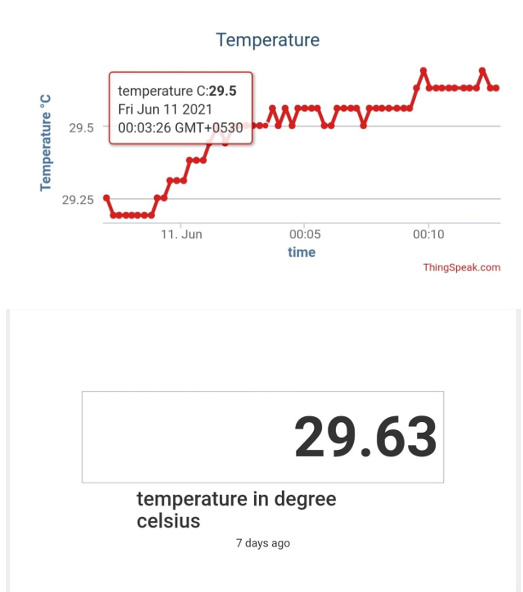

# 👶 AUTOMATIC CRADLE SYSTEM

A smart IoT-based cradle system that automatically swings based on sound detection and monitors a baby's environment. This system notifies parents of any abnormal conditions such as excessive crying, high temperature, or wet diapers.

---

## 📌 Features

- 🎶 Detects baby’s cry and auto-swings cradle
- 🌡 Monitors temperature and diaper wetness
- ☁ Sends real-time data to ThingSpeak Cloud
- 📧 Email alerts via IFTTT for abnormal conditions
- 📊 View data online and ensure baby's safety remotely

---

## 🧰 Components Used

- NodeMCU (ESP8266)
- Sound Sensor
- NTC Temperature Sensor
- Wet Sensor
- Servo Motor
- Cradle frame
- Buzzer, Breadboard, Connecting Wires

---

## 🛠 Tools and Technologies

- Arduino IDE
- ThingSpeak (IoT Data Cloud)
- IFTTT (Email notifications)
- Web Technologies (HTML, CSS, JS)

---

## 🔄 Working Algorithm

---

## 🧱 System Block Diagram

---

## 🛠 System Setup

---

## 📊 Results

### 🔹 Temperature Monitoring

### 🔹 Moisture Detection

### 🔹 Sound Detection

### 🔔 Notifications

---

## 📌 Applications

- Home-based infant monitoring
- Hospitals and daycare centers
- Useful in orphanages and remote baby care

---

## ❗ Limitations

- Cannot distinguish between baby’s laugh and cry
- Sensitive components need cautious handling
- Not a full substitute for human affection

---

## 👩‍💻 Authors

- **Sri Vaishnavi Kiran N** – ECE Dept, Vasavi College of Engineering

---

## 📬 Contact

📧 vaishnavinukala03@gmail.com  
📞 +1 (518) 847-6845  
🌐 [GitHub](https://github.com/VaishnaviKiran)

